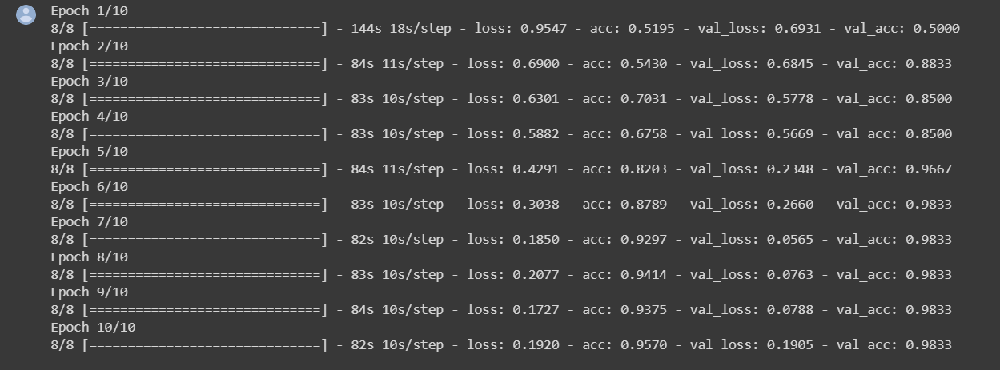
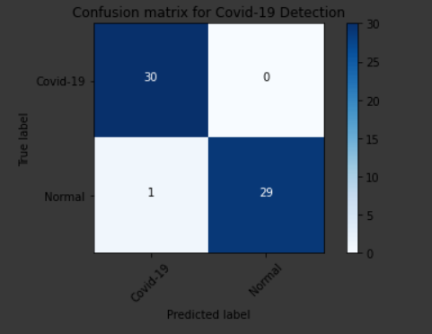
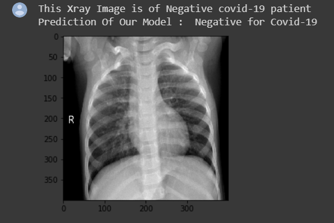

Here's a condensed version of your content:

---

# Covid-19 Detection Using Chest X-Ray

## Overview

This project employs Convolutional Neural Networks (CNNs) to create a classifier that determines whether an individual is infected with Covid-19 based on chest X-ray images.

## Dataset

- Positive Cases: [Covid-ChestXray-Dataset](https://github.com/ieee8023/covid-chestxray-dataset)
- Normal Cases: [Chest X-Ray Pneumonia](https://www.kaggle.com/paultimothymooney/chest-xray-pneumonia)

## Network Architecture

The CNN model architecture is as follows:

- Input shape: (None, 224, 224, 3)
- Conv2D layers
- MaxPooling2D layers
- Dropout layers
- Flatten layer
- Dense layers

The total number of trainable parameters is 1,457,537.

## Accuracy

## Confusion Matrix

(0 for Positive and 1 for Negative cases)

## Predictions

- Prediction of Covid-19 Positive Case

- Prediction of Covid-19 Negative Case

## How to Run

Follow these steps to execute the project:

1. Open a command prompt in the directory where "app.py" is located.
2. Enter the command: `python app.py`
3. Open the specified URL provided in the command prompt during the running process.
4. Upload any chest X-ray image and click "Predict."
5. To stop serving, press CTRL+C.

---

Please note that the project's Kaggle notebook link is available for further details and upvoting.

---